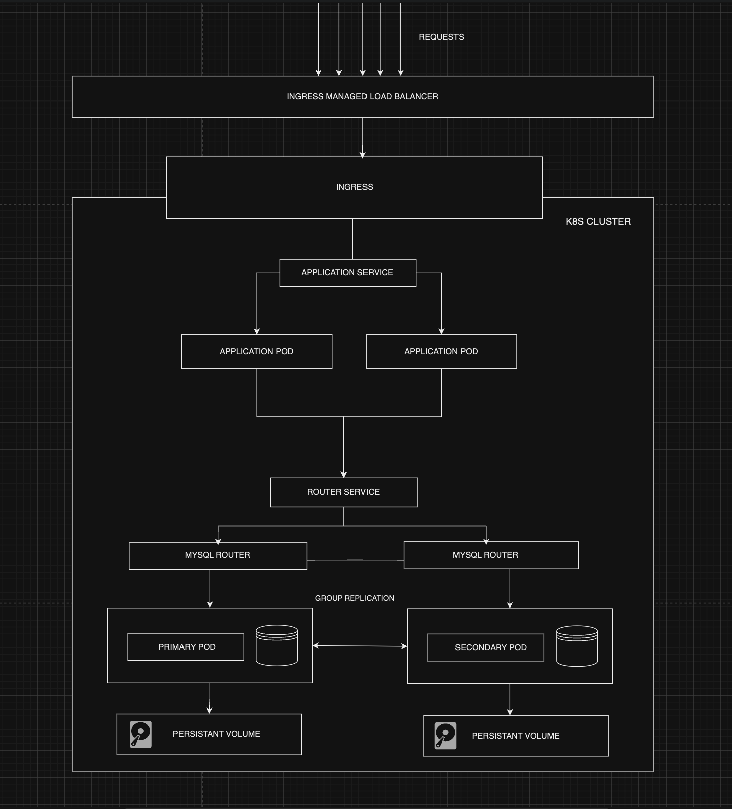

### Architecture



### Project structure

```
spring-cluster/
├─ demo/
├─ infra/
│ ├─ kubernetes
| | ├─ ingress
| │ ├─ mysql-cluster
| | ├─ mysql-router
| │ ├─ application
│ ├─ terraform
├─ README.md
```

- `demo` - contains the sample spring-boot java application
- `infra/kubernetes/application` - k8s manifests for demo app
- `infra/kubernetes/mysql-cluster` - k8s manifests for mysql cluster
- `infra/kubernetes/mysql-router` - k8s manifests for mysql router
- `infra/kubernetes/ingress` - k8s manifests for ingress
- `infra/terraform` contains terraform files for provisioning a kubernetes cluster in google cloud platform

### Prerequisites

Install the necessary command line tools

1. Google cloud account
2. [Terraform cli](https://developer.hashicorp.com/terraform/install)
3. [gcloud SDK](https://cloud.google.com/sdk/docs/install)
4. [kubectl cli](https://kubernetes.io/docs/tasks/tools/#kubectl)

### Provisioning kubernetes cluster in google cloud

1. Enable the **Compute Engine API & Kubernetes Engine API** ƒor the google cloud account
2. Authenticate the gcloud SDK using the google account:

   ```
   gcloud auth login
   ```

3. The terraform module we used relies on a access token to provision resources, use the following gcloud command to pull the access token

   ```
   gcloud auth application-default login
   ```

4. Provision the gke cluster by running the following commands

   ```
   # cd into the infra/kubernetes directory
   cd infra/terraform

   # Downloads the required providers and modules
   terraform init

   # Provisions the cluster
   terraform apply
   ```

5. Pull cluster credentials for the provisioned gke cluster

   ```
   gcloud container clusters get-credentials $(terraform output -raw kubernetes_cluster_name) --region $(terraform output -raw region)
   ```

### Deploying mysql:

1. Apply `infra/kubernetes/mysql-cluster` via kubectl for creating mysql resources:

   ```
   cd infra/kubernetes
   kubectl apply -f ./mysql-cluster
   ```

2. Verify if the mysql pods are ready by using the following command:

   ```
   kubectl get statefulset --watch

   # output: wait until the pods are ready
   NAME            READY   AGE
   mysql-cluster   2/2     30s
   ```

### Configuring group replication

1. For letting our MySQL pods connect to the cluster, use the following command:

   ```
    POD_ORDINAL_START=${1:-0}
    POD_ORDINAL_END=${1:-1}
    for i in $(seq ${POD_ORDINAL_START} ${POD_ORDINAL_END}); do
      echo "Configuring pod mysql-cluster/mysql-cluster-${i}"
      cat <<'  EOF' | kubectl exec -i mysql-cluster-${i} -- bash -c 'mysql -uroot -proot --password=${MYSQL_ROOT_PASSWORD}'
    INSTALL PLUGIN group_replication SONAME 'group_replication.so';
    RESET PERSIST IF EXISTS group_replication_ip_allowlist;
    RESET PERSIST IF EXISTS binlog_transaction_dependency_tracking;
    SET @@PERSIST.group_replication_ip_allowlist = 'mysql-headless-service.default.svc.cluster.local';
    SET @@PERSIST.binlog_transaction_dependency_tracking = 'WRITESET';
      EOF
    done
   ```

2. Connect to MySQL Shell on the Pod `mysql-cluster-0`

   ```
   kubectl exec -it mysql-cluster-0 -- \
       /bin/bash \
       -c 'mysqlsh --uri="root:$MYSQL_ROOT_PASSWORD@mysql-cluster-0.mysql-headless-service.default.svc.cluster.local"'
   ```

3. Verify the MySQL group replication allowlist for connecting to other instances.

   ```
   \sql SELECT @@group_replication_ip_allowlist;
   ```

   The output is similar to the following:

   ```
    +-------------+
    | @@server_id |
    +-------------+
    |          21 |
    +-------------+
   ```

4. Configure each instance for MySQL InnoDB Cluster usage

   ```
   \js
   dba.configureInstance('root@mysql-cluster-0.mysql-headless-service.default.svc.cluster.local', {password: os.getenv("MYSQL_ROOT_PASSWORD")});
   dba.configureInstance('root@mysql-cluster-1.mysql-headless-service.default.svc.cluster.local', {password: os.getenv("MYSQL_ROOT_PASSWORD")});
   ```

5. Verify that the instance is ready to be used in a MySQL InnoDB Cluster. The output should indicate a status of OK

   ```
   dba.checkInstanceConfiguration()
   ```

6. Create the MySQL InnoDB Cluster.

   ```
   var cluster=dba.createCluster('mycluster');
   ```

7. Add our secondary replica instance to the InnoDB cluster, since we are executing in our first instance, the first instance will automatically be our primary

   ```
   cluster.addInstance('root@mysql-cluster-1.mysql-headless-service', {password: os.getenv("MYSQL_ROOT_PASSWORD"), recoveryMethod: 'clone'});
   ```

8. Verify the cluster's status, the field `status.defaultReplicaSet.topology ` should contain our primary and replica instance

   ```
   cluster.status()
   ```

9. Verify everything is working as expected by creating a sample database and table from the shell:

   ```
   # Switch to sql mode from shell
   \sql

   # Create a sample table
   create database loanapplication;
   use loanapplication
   CREATE TABLE loan (loan_id INT unsigned AUTO_INCREMENT PRIMARY KEY, firstname VARCHAR(30) NOT NULL, lastname VARCHAR(30) NOT NULL , status VARCHAR(30) );


   # Populate sample data
   INSERT INTO loan (firstname, lastname, status) VALUES ( 'Fred','Flintstone','pending');
   INSERT INTO loan (firstname, lastname, status) VALUES ( 'Betty','Rubble','approved');


   # Verify that the table contains the three rows
   SELECT * FROM loan;
   ```

### Deploying mysql router:

1. Apply `infra/kubernetes/mysql-router` via kubectl

   ```
   cd infra/kubernetes
   kubectl apply -f ./mysql-router
   ```

2. Verify if the mysql-router pods are ready by using the following command:

   ```
   kubectl get pods --watch
   ```

### Deploying the spring boot java application:

1. Apply `infra/kubernetes/application` via kubectl

   ```
   cd infra/kubernetes
   kubectl apply -f ./application
   ```

2. Verify if the application pods are ready by using the following command:

   ```
   kubectl get pods --watch
   ```

### Deploying ingress

1. Deploy nginx-ingress controller

   ```
   # For providing permissions
   kubectl create clusterrolebinding cluster-admin-binding \
      --clusterrole cluster-admin \
      --user $(gcloud config get-value account)

   # Deploy ingress controller
   kubectl apply -f https://raw.githubusercontent.com/kubernetes/ingress-nginx/controller-v1.8.2/deploy/static/provider/cloud/deploy.yaml
   ```

2. Apply `infra/kubernetes/application` via kubectl

   ```
   cd infra/kubernetes
   kubectl apply -f ./ingress
   ```

3. Get the external ip of the load-balancer to view application

   ```
   kubectl get svc
   ```

### Test endpoints

1. Send a http get request for getting all the users

   ```
   curl http://<external-load-balancer-ip>/users/all
   ```

2. Send a http post request for adding a user

   ```
   curl http://<external-load-balancer-ip>/demo/add -d name=Second -d email=someemail@someemailprovider.com
   ```
